# BUSINESS REQUIREMENTS DOCUMENT
# eCHECK APPLICATION
## DIGITAL CHECKLIST MANAGEMENT PLATFORM

---

| Version | Revision Date | Description of Change | Author |
|---------|--------------|----------------------|--------|
| 1.0.0 | 19/03/2026 | Initial document version | Tété Danklou |

---

## TABLE OF CONTENTS

1. [Summary](#1-summary)
2. [Project Scope](#2-project-scope)
3. [Roadmap](#3-roadmap)
4. [Detailed Product Description](#4-detailed-product-description)
   - [Epic 1 – Generic](#epic-1--generic)
   - [Epic 2 – Dashboard](#epic-2--dashboard)
   - [Epic 3 – Checklist Creation](#epic-3--checklist-creation)
   - [Epic 4 – Checklist Execution](#epic-4--checklist-execution)
   - [Epic 5 – Validation](#epic-5--validation)
   - [Epic 6 – Field Declarations](#epic-6--field-declarations)
   - [Epic 7 – Notifications](#epic-7--notifications)
   - [Epic 8 – History of Changes](#epic-8--history-of-changes)
   - [Epic 9 – Reports & Analytics](#epic-9--reports--analytics)

---

## 1. SUMMARY

The objective of this document is to define the requirements for **eCheck**, a digital industrial checklist management platform. The tool is designed to support manufacturing, quality control, and safety environments by enabling managers to create structured, configurable checklists and operators to execute them in a consistent and traceable manner.

eCheck replaces paper-based and disconnected checklist workflows with a structured digital process. It includes real-time scoring, a conditional trigger engine, multi-step validation, and operational field declarations (tags, immediate actions, risk assessments), all backed by a complete audit trail.

The application aims to:
- **Reduce data loss** through robust autosave and crash recovery.
- **Speed up checklist completion** via a clear UI, adapted field components, QR scan, and calendar integration.
- **Improve governance** through reports, history, PDF exports, and audit trails.
- **Increase user confidence** via live preview, validation workflows, and clear status indicators.
- **Support offline operation** with local caching and automatic resynchronization.

---

## 2. PROJECT SCOPE

The eCheck platform covers the full lifecycle of a digital checklist:

1. **Creation**: A three-step wizard for managers to define checklist metadata, build a question set using 24+ field types with a drag-and-drop builder, and preview/publish the checklist.
2. **Assignment**: Checklists are assigned to specific users, teams, or all plant operators with configurable frequency (one-off, permanent, recurring).
3. **Execution**: Operators fill in checklists through a guided interface with real-time scoring, trigger-based automation, and the ability to declare operational events.
4. **Validation**: Managers review submitted checklists and either approve or reject them with comments.
5. **Reporting & Audit**: Full history of changes, performance reports, and exportable audit records.

The platform is role-aware, presenting different interfaces and capabilities to **Managers** and **Operators/Users** based on their role.

---

## 3. ROADMAP

| Date | Description |
|------|-------------|
| Q1 2026 | Business Requirements Documentation |
| Q2 2026 | Development – Core Checklist Lifecycle (Epic 1–5) |
| Q3 2026 | Development – Declarations, Notifications, Reports (Epic 6–9) |
| Q3 2026 | Internal Pilot Phase |
| Q4 2026 | Global Rollout |

---

## 4. DETAILED PRODUCT DESCRIPTION

### LIST OF EPICS

1. Generic
2. Dashboard
3. Checklist Creation
4. Checklist Execution
5. Validation
6. Field Declarations
7. Notifications
8. History of Changes
9. Reports & Analytics

---

## EPIC 1 – GENERIC

### EPIC 1 LIST OF USER STORIES

| Epic ID | Requirement |
|---------|-------------|
| E1.US1 | Name, Logo and Colors |
| E1.US2 | User Roles |
| E1.US3 | Header |
| E1.US4 | Navigation Menu – Manager |
| E1.US5 | Navigation Menu – Operator/User |

---

### USER STORIES DESCRIPTION

#### E1.US1 – Name, Logo and Colors

**Name:**
The application is named **eCheck**. This name directly reflects the core purpose of the tool: to digitalize and streamline industrial checklist management, making it more efficient, transparent, and accessible.

**Logo Concept:**
The logo is designed to visually represent the structured and reliable nature of checklist verification. It incorporates:
- A clean, modern design aligned with digital transformation.
- Visual cues representing a completed checkmark embedded within a data-driven interface.

**Color Palette:**
The design system is based on a set of CSS custom properties defining both a light and dark theme. Key UI colors are used consistently across all components for visual hierarchy and status communication:
- **Primary action color**: Used for buttons, active states, and primary highlights.
- **Status colors**:
  - Green: Completed / Approved / On track.
  - Yellow/Amber: In progress / Pending / Warning.
  - Red: Overdue / Rejected / Critical.
  - Blue: Informational / Draft.
  - Gray: Cancelled / Inactive.

---

#### E1.US1 – Role Selection Screen

When a user opens eCheck for the first time (or after clearing their session), they are presented with a role selection screen to choose their access level before entering the application.

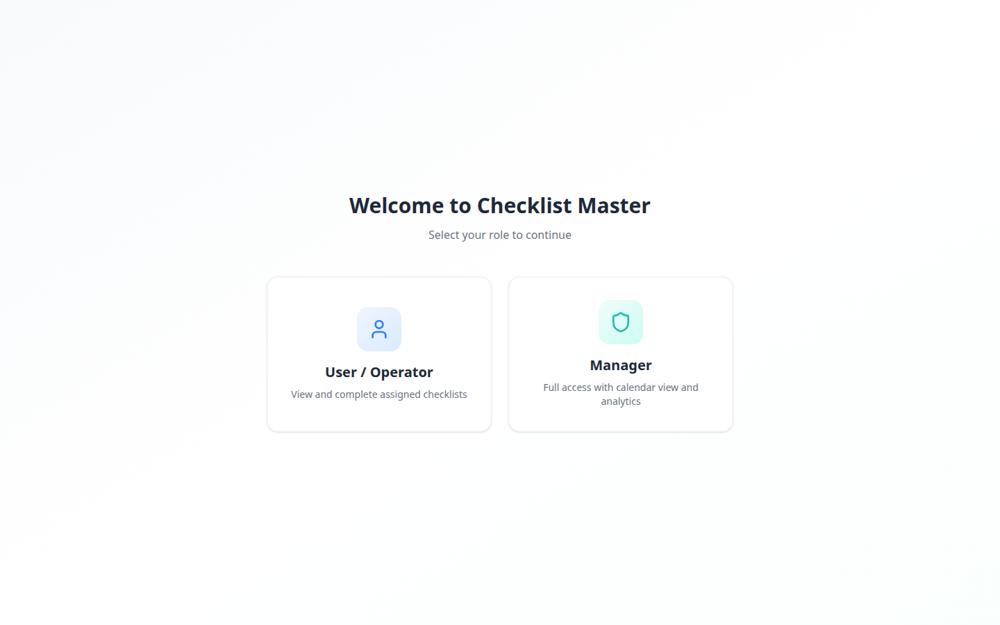
*Figure 1 – Role selection screen: User/Operator and Manager entry points*

---

#### E1.US2 – User Roles

The application defines two primary roles with different levels of access and responsibilities:

**Manager**
- Highest level of access.
- Can create, edit, publish, and delete checklists.
- Can assign checklists to users or teams.
- Can view, approve, and reject submitted checklists.
- Can access reports and full audit history.
- Can configure master data (categories, locations, teams).

**Operator / User**
- Standard access for day-to-day operation.
- Can view and fill out checklists assigned to them.
- Can save drafts and submit completed checklists.
- Can declare tags, immediate actions, and operational events during execution.
- Cannot create or publish checklists.
- Cannot validate or reject submissions.

**Role Permissions Matrix:**

| Function | Manager | Operator/User |
|----------|---------|---------------|
| View Dashboard | Full (all assignments) | Limited (own tasks) |
| Create Checklist | Yes | No |
| Edit Checklist | Yes (all) | No |
| Publish Checklist | Yes | No |
| Delete Checklist | Yes | No |
| Execute Checklist | Yes | Yes |
| Submit Checklist | Yes | Yes |
| Validate Submission | Yes | No |
| Reject Submission | Yes | No |
| View Reports | Yes | No |
| Configure Master Data | Yes | No |
| Declare Tags/Actions | Yes | Yes |

---

#### E1.US3 – Header

The application header follows a standard layout ensuring consistency across all screens. It includes the following elements:

1. **Hamburger Icon (Left Side)**
   - Located at the far left of the header.
   - When clicked, it expands the left-side navigation menu.

2. **Application Name / Logo (Next to Hamburger Icon)**
   - Functions as a button that redirects the user to the Dashboard (home page).

3. **Notifications Bell (Right Side)**
   - Displays a badge with the count of unread notifications.
   - When clicked, it opens the notifications panel.

4. **User Menu (Far Right)**
   - Displays the user's name.
   - When clicked, it shows:
     - The user's current role (Manager / Operator).
     - Role toggle (to switch between Manager and Operator views).
     - Logout option.

---

#### E1.US4 – Navigation Menu – Manager

When a Manager opens the side navigation menu, the following items are displayed:

- **Dashboard** – Redirects to the main dashboard with all assignments and pending validations.
- **Create Checklist** – Opens the 3-step checklist creation wizard.
- **Checklist Master** – Redirects to the full list of all published and draft checklists.
- **Reports** – Redirects to the analytics and reporting section.
- **Settings / Configuration** – Redirects to the configuration page (categories, locations, teams).
- **Notifications** – Opens the notifications panel.

---

#### E1.US5 – Navigation Menu – Operator/User

When an Operator opens the side navigation menu, the following items are displayed:

- **Dashboard (My Tasks)** – Redirects to the personal task list (pending, in-progress assignments).
- **My Drafts** – Lists checklist submissions saved as drafts.
- **Notifications** – Opens the notifications panel.

---

## EPIC 2 – DASHBOARD

### EPIC 2 LIST OF USER STORIES

| Epic ID | Requirement |
|---------|-------------|
| E2.US1 | Dashboard Layout & KPIs |
| E2.US2 | Filters |
| E2.US3 | Calendar View |
| E2.US4 | Quick Actions |

---

### USER STORIES DESCRIPTION

#### E2.US1 – Dashboard Layout & KPIs

The Dashboard is the main homepage of the eCheck application. It presents a clean, structured interface designed for quick visibility of checklist status and operational health.

**Manager Dashboard – All Checklists View**


*Figure 2 – Manager dashboard: all checklists overview with KPI summary and checklist tiles*

**Manager Dashboard – Pending Validations Tab**

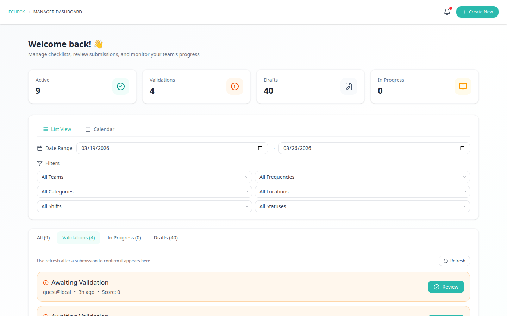
*Figure 3 – Manager dashboard: submissions awaiting review (Validations tab)*

**Manager Dashboard – Drafts Tab**

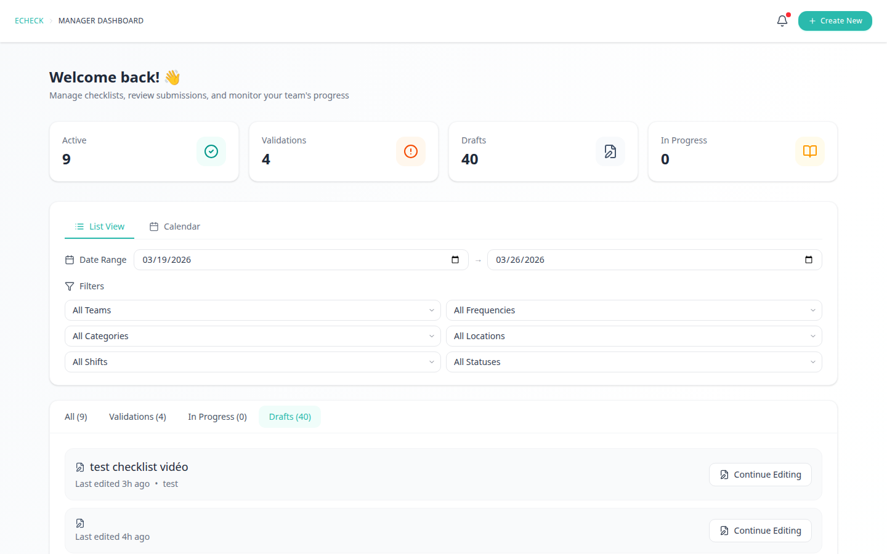
*Figure 4 – Manager dashboard: unpublished draft checklists (Drafts tab)*

**Manager Dashboard – In Progress Tab**

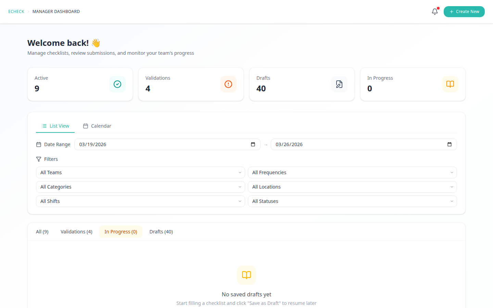
*Figure 5 – Manager dashboard: checklists currently being executed (In Progress tab)*

**Manager View – Tabs:**
- **Pending Validations**: All submissions awaiting manager review.
- **All Checklists**: All active, published checklists.
- **Drafts**: Checklists in draft state not yet published.

**Operator Dashboard**

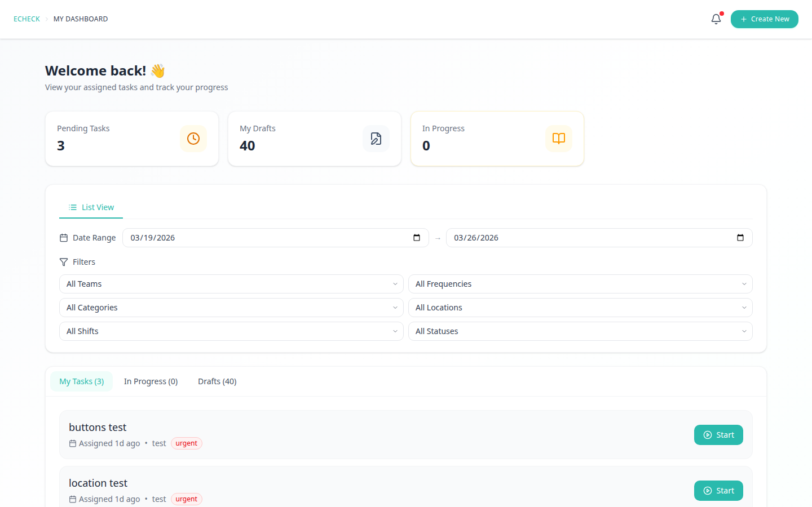
*Figure 8 – Operator dashboard: personal task list with pending and in-progress assignments*

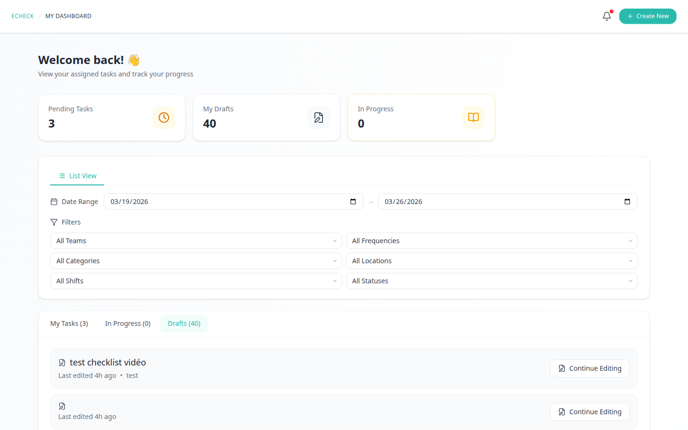
*Figure 9 – Operator dashboard: submission drafts in progress*

**Operator View – Tabs:**
- **My Tasks**: Pending assignments for the current user.
- **My Drafts**: Submission drafts in progress.
- **In Progress**: Assignments currently being filled.

**Checklist Tiles:**
Each checklist entry is displayed as a tile with the following information:
- Checklist title and category badge.
- Priority flag (Urgent / High / Normal / Low) with color coding.
- Frequency type (Permanent / One-off / Recurring).
- Assignment target (user name, team, or "All").
- Due date and time remaining (e.g., "Expired: 4 hrs 14 min | Due: 14-01-2026").
- Current status badge (Draft / Assigned / In Progress / Overdue / Completed).
- Quick action icons: Share, Open.

**Key KPI Summary Cards (Manager View):**
- Total active checklists.
- Number of pending validations.
- Number of overdue/expired assignments.
- Completion rate (%).

---

#### E2.US2 – Filters

At the top of the dashboard, a sticky filter bar provides the following filtering options:

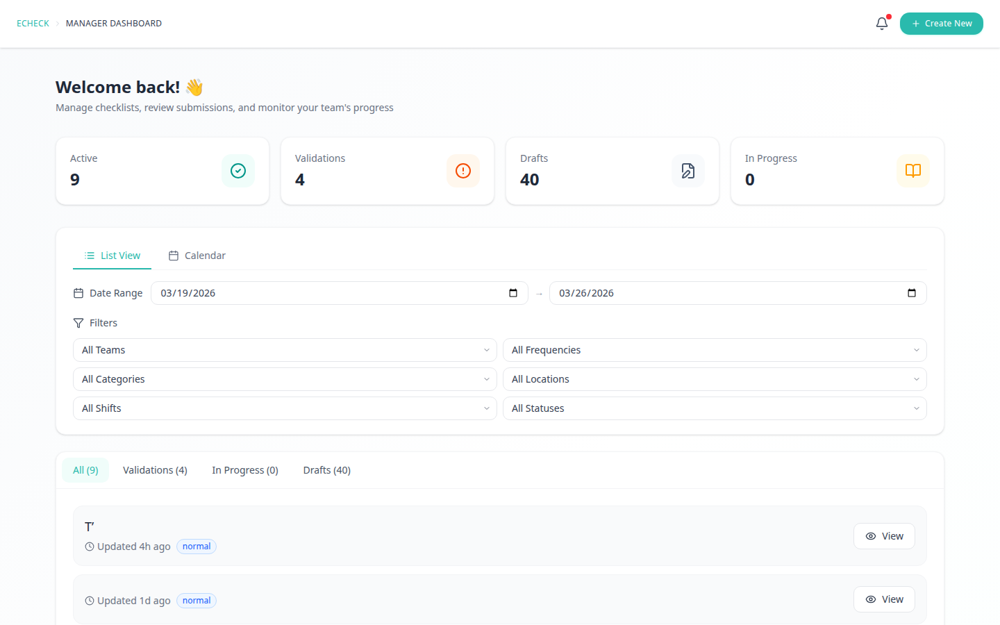
*Figure 6 – Dashboard filter panel: multi-criteria filtering for checklists*

- **Status**: Draft, Assigned, In Progress, Overdue/Expired, Completed.
- **Frequency**: Permanent, One-off, Recurring.
- **Team**: Filter by assigned team.
- **Category**: Filter by checklist category.
- **Location**: Filter by site, zone, or line.
- **Date Range**: Filter by assignment or due date.
- **Shift**: Filter by work shift.
- **My Risk / My Tasks**: Toggle to show only items relevant to the logged-in user.
- **Reset**: Clears all active filters.

Active filters are displayed as removable chips below the filter bar. All tiles and counts update dynamically based on the selected filters.

---

#### E2.US3 – Calendar View

As an alternative to the tile/list view, users can switch to a **Calendar View** that displays checklists by their scheduled date.

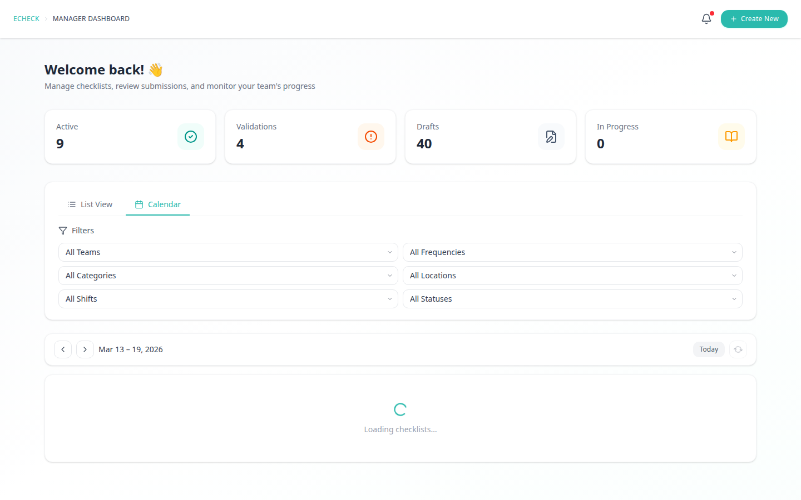
*Figure 7 – Calendar view: monthly calendar showing checklists by their scheduled date*

- The calendar supports a **monthly view** by default.
- Each day cell shows the checklists valid or due on that date.
- Clicking on a checklist in the calendar opens its detail or redirects to the execution form.
- The calendar respects the same active filters as the list view.

---

#### E2.US4 – Quick Actions

The Dashboard provides the following quick action buttons accessible at all times:

- **Create Checklist** (Manager only): Opens the 3-step creation wizard.
- **Scan QR**: Activates the device camera to scan a QR code linked to a specific checklist or assignment, redirecting directly to the execution form.

---

## EPIC 3 – CHECKLIST CREATION

### EPIC 3 LIST OF USER STORIES

| Epic ID | Requirement |
|---------|-------------|
| E3.US1 | Creation Workflow (3-Step Wizard) |
| E3.US2 | Step 1 – Metadata |
| E3.US3 | Step 2 – Field Builder (Drag & Drop) |
| E3.US4 | Field Types |
| E3.US5 | Trigger Builder |
| E3.US6 | Step 3 – Preview & Publish |
| E3.US7 | Autosave System |
| E3.US8 | Conflict Detection |

---

### USER STORIES DESCRIPTION

#### E3.US1 – Creation Workflow (3-Step Wizard)

The checklist creation process follows a structured three-step wizard:

1. **Step 1 – Metadata**: Define the checklist configuration (title, category, priority, frequency, assignment, location, validity, validation settings).
2. **Step 2 – Field Builder**: Design the question set using a drag-and-drop canvas with a palette of 24+ field types.
3. **Step 3 – Preview & Publish**: Review the full checklist in read-only preview mode and publish it.

Users can navigate between steps freely. Progress is continuously autosaved so no data is lost on navigation or accidental closure.

---

#### E3.US2 – Step 1: Metadata

As a manager, I need to configure all general settings for a checklist before designing its content.

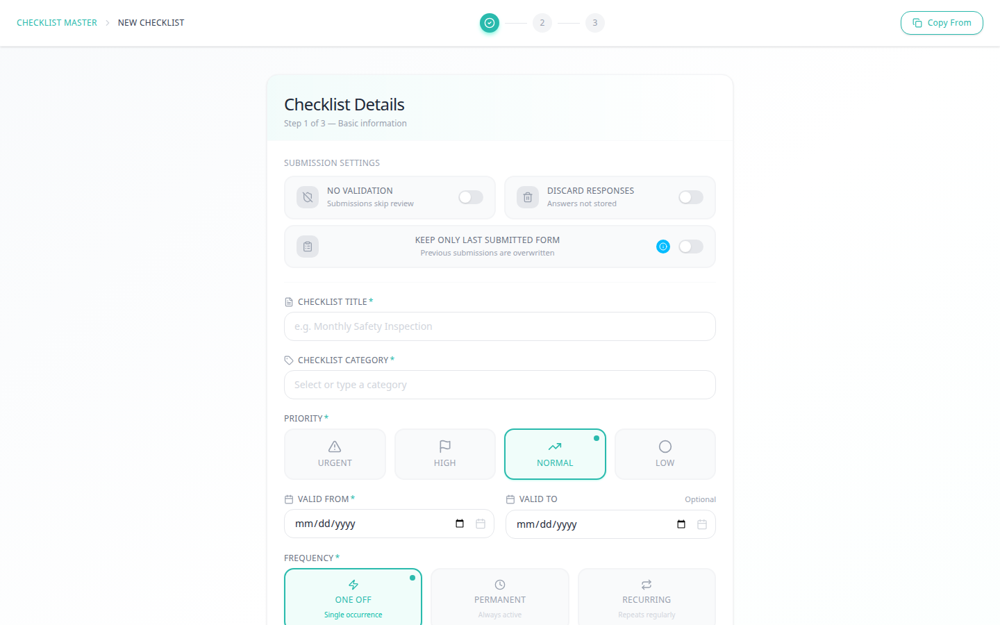
*Figure 10 – Checklist creation Step 1: title, category, and priority configuration*

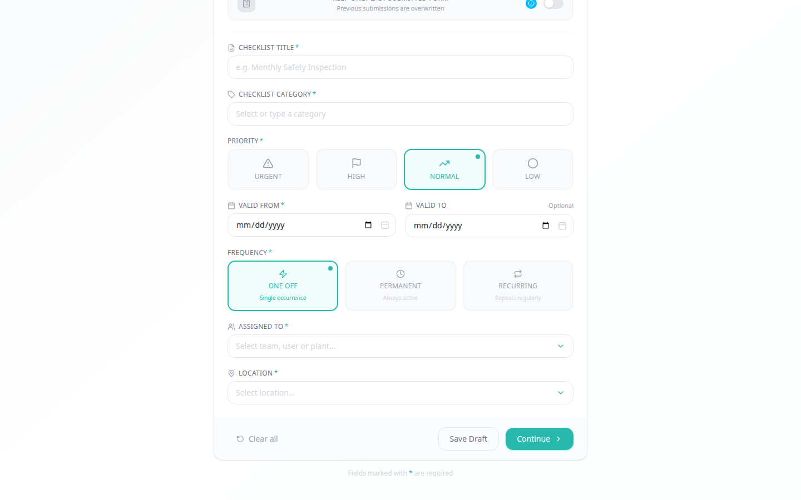
*Figure 11 – Checklist creation Step 1 (continued): frequency, assignment, location, and validation settings*

**Acceptance Criteria:**

- **Title**:
  - Free-text field.
  - If left blank, the system auto-generates a name in the format: `CHK-YYYYMMDD-HHhMM-XXX`.
  - Mandatory for publishing.

- **Category**:
  - Dropdown selection from a configurable list of categories.
  - Mandatory.

- **Priority**:
  - Radio button or flag selector with four options: Urgent, High, Normal, Low.
  - Each priority level is associated with a defined number of reminders sent to the assigned user.
  - Color-coded flags displayed throughout the application.

- **Frequency**:
  - Three options: One-off, Permanent, Recurring.
  - For **Recurring**: A scheduler is displayed allowing cron-style configuration or preset options (daily, weekly, monthly).
  - For **Permanent**: The checklist remains active indefinitely until deactivated.
  - For **One-off**: A single occurrence with an optional due date.

- **Validity**:
  - Optional date range picker (from / to dates) defining when the checklist is accessible.
  - If "Permanent" frequency is selected, the validity end date is not required.

- **Assignment**:
  - Assign to a specific user (with name search), a team (selectable from the team list), or all users.
  - A single selection only.

- **Location**:
  - Three-level hierarchical selector: Site → Zone → Line.
  - Used to filter checklists in the dashboard and reports.

- **Validation Required**:
  - Toggle switch to indicate whether submitted checklists require manager validation before being marked as complete.
  - Default: Off.

- **Assigned Manager**:
  - Dropdown selector to designate the manager responsible for validation.
  - Only visible when "Validation Required" is toggled on.
  - Displays only users with the Manager role.

---

#### E3.US3 – Step 2: Field Builder (Drag & Drop)

As a manager, I want to design the content of a checklist by dragging field components from a palette onto a canvas organized in sections.


*Figure 12 – Step 2 field builder: canvas area with drag-and-drop sections and fields*

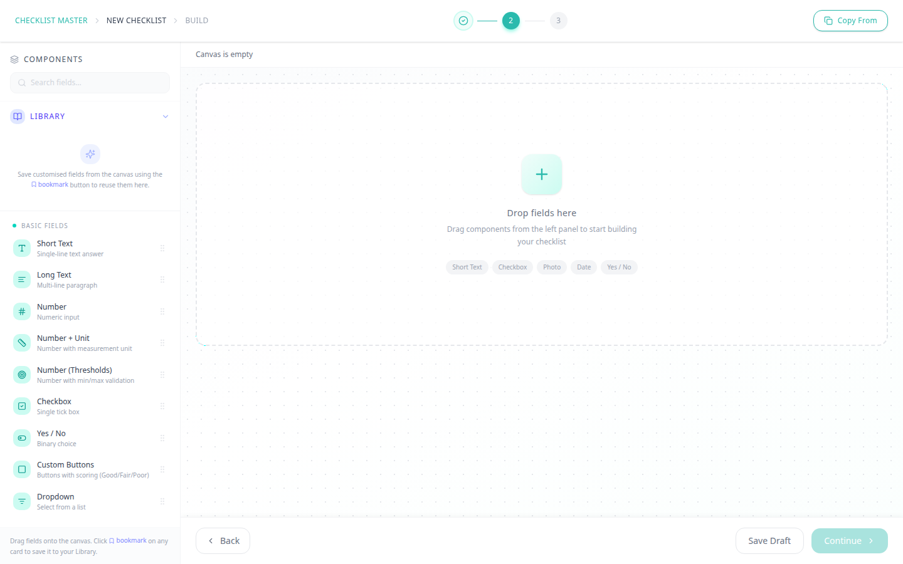
*Figure 13 – Step 2 component palette: Basic Fields, Date & Time, Media & Evidence, Structure, and Advanced field types*

**Acceptance Criteria:**

- **Left Palette**: Displays all available field types grouped into 5 categories. Users drag a field from the palette to the canvas to add it.

- **Canvas (Right Side)**:
  - Contains one or more **Sections** (collapsible containers for grouping related fields).
  - Fields can be reordered within a section via drag-and-drop.
  - Fields can be moved between sections.
  - Sections can be reordered.

- **Section Management**:
  - Button to add a new section.
  - Each section has a configurable title.
  - Sections can be collapsed/expanded in preview mode.

- **Field Configuration Panel**:
  - Clicking on a field in the canvas opens its configuration panel on the right side.
  - Common properties available for all field types: Label, Help text, Required (toggle), Unique ID.
  - Additional properties vary by field type (see E3.US4).

- **Field Actions (3-dot menu per field)**:
  - Delete: Removes the field from the canvas.
  - Duplicate: Creates a copy of the field with all its configuration.
  - Add to Library: Saves the configured field as a reusable component.

- **Trigger Builder**: Each field has a "Triggers" tab in its configuration panel. See E3.US5.

---

#### E3.US4 – Field Types

The following 24 field types are available in the field builder palette, grouped into 5 categories:

**Category 1 – Basic**

| Field Type | Description & Key Configuration Options |
|---|---|
| **Short Text** | Single-line text input. Config: Label, Placeholder, Max length, Required. |
| **Long Text** | Multi-line text area. Config: Label, Placeholder, Max length, Required. |
| **Number** | Strict numeric input (no scientific notation). Config: Label, Min value, Max value, Decimal precision, Required. |
| **Number + Unit** | Numeric input with a unit selector. Config: Label, Unit (e.g., kg, °C, mm), Sub-unit, Decimal precision, Required. |
| **Number (Thresholds)** | Numeric input with configurable color-coded threshold ranges. Config: Label, Thresholds (operator, value, color: Green/Yellow/Red), Trigger actions on threshold breach. |
| **Checkbox** | Boolean toggle (checked / unchecked). Config: Label, Default state. |
| **Yes / No** | Two-button binary choice. Config: Label, Scoring (Yes = OK, No = Not OK or custom). |
| **Custom Buttons** | A set of fully configurable buttons. Config: Button name, Background color, Font color, Score (numeric, Relevant, Not Applicable), Default selection, Notify user on click, Reveal linked section on click. |
| **Dropdown** | Single or multi-select dropdown. Config: Label, Options list, Allow search, Allow "Other + free text", Cascading dependency on another field. |

**Category 2 – Date & Time**

| Field Type | Description & Key Configuration Options |
|---|---|
| **Date** | Calendar date picker. Config: Label, Min/Max date, Default (today), Required. |
| **Time** | Time picker. Config: Label, Format (HH:MM / 12h), Default (now), Required. |
| **Date & Time** | Combined date and time picker. Config: Label, Min/Max, Default, Timezone handling, Required. |

**Category 3 – Media & Evidence**

| Field Type | Description & Key Configuration Options |
|---|---|
| **Photo** | Camera capture or file upload for images. Config: Label, Max file size, Allowed formats (JPG, PNG), Compression, Required. |
| **Video** | Video capture or upload. Config: Label, Max duration, Max file size, Required. |
| **Media Embed** | Display-only embedded image or video for instructions (not fillable by the operator). Config: Upload media file, Caption. |
| **File Upload** | Upload any supporting document. Config: Label, Allowed formats (PDF, XLSX, etc.), Max file size, Required. |
| **Signature** | Digital signature capture via touch/mouse. Config: Label, "Sign before submit" enforcement, Required. |
| **Barcode / QR** | Barcode or QR code scanner via device camera. Config: Label, Expected format (QR, EAN, etc.), Required. |

**Category 4 – Structure**

| Field Type | Description & Key Configuration Options |
|---|---|
| **Section** | Creates a new collapsible section container on the canvas. Config: Section title, Default state (expanded/collapsed). |
| **Instruction** | A read-only text/markdown block displayed to the operator. Config: Content (markdown), Optional embedded image. |
| **Separator** | A visual horizontal divider for grouping within a section. No configuration. |

**Category 5 – Advanced**

| Field Type | Description & Key Configuration Options |
|---|---|
| **Rating** | Star or numeric rating input. Config: Label, Scale (e.g., 1–5), Required. |
| **Location** | GPS or manual location picker. Config: Label, Required. |
| **Temperature** | Specialized numeric field for temperature readings. Config: Label, Unit (°C / °F), Min/Max thresholds, Required. |
| **Formula** | Auto-computed read-only field that calculates a result based on values from other numeric fields. Config: Formula expression using field IDs. |

---

#### E3.US5 – Trigger Builder

As a manager, I want to define automated conditional rules on each field so that the checklist can react dynamically to operator inputs.

**Structure of a Trigger:**
```
WHEN [condition on this field] → DO [impact]
```

A field can have multiple triggers. Triggers are evaluated in real time during checklist execution.

**Condition Types (examples by field type):**

| Field Type | Available Conditions |
|---|---|
| Text | Contains, Does not contain, Is empty, Is not empty, Equals |
| Number / Threshold | Is greater than, Is less than, Is equal to, Is between, Threshold breached (High/Medium/Low) |
| Yes / No | Is "Yes", Is "No" |
| Custom Buttons | Button X is selected |
| Checkbox | Is checked, Is unchecked |
| Dropdown | Option X is selected, Any option selected |
| Date / Time | Is before, Is after, Is today, Is overdue |
| Photo / Video / File | Has been provided, Has not been provided |
| Location | Within radius of [coordinates], Outside radius |
| Rating | Is equal to, Is greater than, Is less than |

**Impact Types (actions triggered when condition is met):**

| Impact ID | Impact Type | Description |
|---|---|---|
| `mark_not_ok` | Mark as Not OK | Flags the field or section as non-conformant. |
| `open_risk` | Open Risk Assessment | Automatically opens the Risk Assessment declaration modal. |
| `open_tag` | Open Tag Declaration | Automatically opens the Tag/Anomaly declaration modal. |
| `open_action` | Open Action Item | Automatically opens the Immediate Action declaration modal. |
| `notify_inapp` | In-App Notification | Sends an in-app notification to a specified user or role. |
| `notify_email` | Email Notification | Sends an email notification to a specified user or email address. |
| `block_submit` | Block Submission | Prevents the operator from submitting the checklist until the condition is resolved. |
| `require_photo` | Require Photo | Makes a photo field mandatory as a consequence of this condition. |
| `autofill_field` | Auto-fill Field | Populates another specified field with a predefined value. |
| `show_field` | Show Field/Section | Makes a previously hidden field or section visible. |
| `hide_field` | Hide Field/Section | Hides a field or section when the condition is met. |
| `escalate` | Escalate | Flags the submission for priority review by a manager. |
| `add_note` | Add Note | Automatically appends a note or comment to the submission. |

**Trigger Events (when triggers are evaluated):**
- On opening the checklist (for pre-fill or visibility logic).
- On every answer change (real-time evaluation).
- On threshold breach (for numeric threshold fields).
- On submission attempt.

---

#### E3.US6 – Step 3: Preview & Publish

As a manager, I want to review the complete checklist before making it available to operators.


*Figure 14 – Step 3: full read-only preview of the checklist with metadata summary and publish options*

**Acceptance Criteria:**

- Displays a full read-only preview of all sections and fields with their labels, help text, and configuration (required markers, threshold colors, etc.).
- Displays a metadata summary panel (title, category, priority, frequency, assignment, location, validity, validation settings).
- Validation checks are run automatically:
  - Warns if no fields have been added.
  - Warns if required metadata fields are missing.
  - Warns if any detected conflicts exist (e.g., duplicate checklist – see E3.US8).
- **Action Buttons**:
  - **Save as Draft**: Saves the checklist without publishing. It will not appear in operator task lists.
  - **Publish**: Makes the checklist active and creates the corresponding assignments. Published checklists appear in the dashboard and operator task lists.

---

#### E3.US7 – Autosave System

As a manager, I want all my checklist creation work to be automatically saved at all times so that I never lose progress.

**Acceptance Criteria:**

- **Debounce Save**: Any change to the checklist (metadata or field canvas) triggers a save after a 2-second debounce.
- **Event-Based Save**: A save is also triggered on blur (leaving an input field) and on navigation between wizard steps.
- **Visual Indicator**: A floating `AutosaveIndicator` component displays the current save state:
  - **Saving...**: Save in progress (spinner icon).
  - **Saved ✓**: Last save was successful with a timestamp.
  - **Offline**: No internet connection detected. Changes are queued locally.
  - **Error**: Save failed. User is notified and can retry manually.
  - **Conflict**: A newer version exists on the server. User is prompted to resolve.
- **Offline Support**:
  - When offline, changes are stored in the browser's local cache.
  - A retry loop (every 5 seconds) attempts to resynchronize queued saves when the connection is restored.
  - Base64 media data is stripped from the local cache to prevent storage quota errors.
- **Versioning**: Each save increments a version counter on the checklist. Conflicts are detected by comparing the local version with the server version.

---

#### E3.US8 – Conflict Detection

As a manager, I want to be alerted if a checklist I am creating is a duplicate of an existing one so that I can avoid redundant checklists.

**Acceptance Criteria:**

- The system checks for duplicate checklists based on the combination of **Title** and **Frequency**.
- If a duplicate is detected during autosave, a **Conflict Modal** is displayed with:
  - A message identifying the conflicting checklist.
  - Option to **Continue Anyway** (create a new checklist despite the duplication).
  - Option to **Discard and Open Existing** (navigate to the existing checklist).
- The conflict check is performed server-side to ensure accuracy across all users.

---

## EPIC 4 – CHECKLIST EXECUTION

### EPIC 4 LIST OF USER STORIES

| Epic ID | Requirement |
|---------|-------------|
| E4.US1 | Execution Workflow |
| E4.US2 | Field Rendering & Interaction |
| E4.US3 | Real-Time Scoring |
| E4.US4 | Trigger Engine (Runtime) |
| E4.US5 | Draft Saving During Execution |
| E4.US6 | Completion Actions |
| E4.US7 | Submission |

---

### USER STORIES DESCRIPTION

#### E4.US1 – Execution Workflow

As an operator, I want to open and fill out a checklist assigned to me in a clear, step-by-step manner.

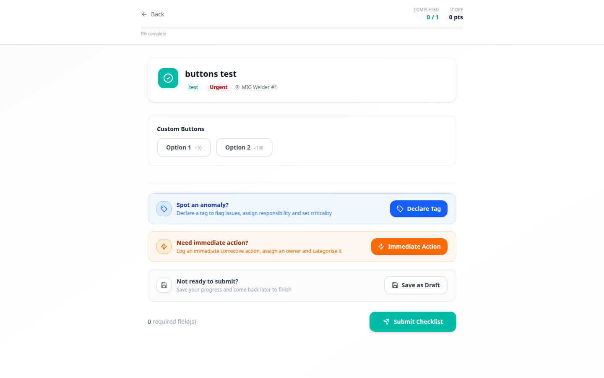
*Figure 15 – Checklist execution screen: section navigation and progress indicator*


*Figure 16 – Checklist execution: interactive field rendering with real-time scoring*


*Figure 17 – Checklist execution: media fields, signature capture, and trigger-based interactions*

**Acceptance Criteria:**

- From the Dashboard (My Tasks tab), clicking a checklist assignment opens the **Checklist Execution** screen.
- The execution screen loads the full checklist definition (all sections, fields, configuration, and triggers) from the backend.
- A **progress bar** at the top of the screen shows the percentage of fields that have been answered (0–100%).
- Sections are displayed sequentially. The user can navigate between sections using "Previous" and "Next" section buttons, or by clicking directly on a section title.
- Completed sections are visually marked.
- A **floating action bar** is always visible with:
  - Current section indicator.
  - Tag declaration button (to open the Tag Declaration Modal).
  - Immediate Action button (to open the Immediate Action Modal).
  - Save Draft button.
  - Submit button (enabled only when all required fields are filled).

---

#### E4.US2 – Field Rendering & Interaction

As an operator, each field type must render with an appropriate and intuitive input UI adapted to the field type.

**Acceptance Criteria:**

All 24 field types defined in E3.US4 must be rendered in interactive "fill mode" during execution. Key rendering behaviors include:

- **Required fields**: Marked with an asterisk (*). Unanswered required fields prevent submission.
- **Help text**: Displayed below the field label as supplementary guidance.
- **Threshold fields**: Color the input background in real time based on the entered value and configured thresholds (Green / Yellow / Red).
- **Custom Buttons**: Render as a set of styled buttons. Clicking a button selects it and applies the associated score.
- **Media fields** (Photo, Video, File): Provide upload and camera capture options. Uploaded files are displayed as thumbnails or previews.
- **Signature**: Renders a canvas for finger/mouse signature capture. The "sign before submit" option blocks submission if no signature is provided.
- **Formula**: Computed automatically and displayed as read-only whenever any of the referenced fields change.
- **Instruction / Media Embed**: Displayed as read-only informational content. No input required.
- **Barcode/QR**: Activates the device camera for code scanning.

---

#### E4.US3 – Real-Time Scoring

As a manager and operator, I want each submission to have a score calculated in real time based on the answers provided.

**Acceptance Criteria:**

- Each field that has scoring configured (Custom Buttons, Yes/No, Threshold, Rating) contributes to the total submission score.
- The score is calculated continuously as the operator fills in the form.
- The overall score and a score breakdown by section are displayed on the execution screen.
- Fields are flagged as "not OK" when a Non-conformant answer is given (based on field configuration or trigger impact `mark_not_ok`).
- Flagged fields are highlighted in the execution view.

---

#### E4.US4 – Trigger Engine (Runtime)

As a manager, I want the triggers I configured in the builder to fire automatically and in real time as the operator fills in the checklist.

**Acceptance Criteria:**

- The trigger evaluation engine runs client-side (`triggerEngine.ts`) and is invoked on every field value change.
- All triggers for all fields in the checklist are evaluated simultaneously on each change.
- When a trigger condition is met and its impact fires:
  - Impacts that affect UI (show/hide field, require photo, block submit) are applied immediately and silently.
  - Impacts that open modals (open risk, open tag, open action) display a **Trigger Fired Modal** informing the operator that an action is required, and then opening the corresponding declaration modal.
  - Impacts that send notifications (in-app, email) are processed by the backend.
- Triggers that are no longer satisfied (condition no longer true) reverse their UI impacts where applicable (e.g., hidden fields reappear, required-photo constraint is lifted).

---

#### E4.US5 – Draft Saving During Execution

As an operator, I want my progress to be automatically saved while I am filling out a checklist so that I can resume at any time without losing my work.

**Acceptance Criteria:**

- The execution screen periodically saves the current state of all answers as a **draft submission** to the backend.
- The draft is restored automatically when the operator re-opens the same assignment.
- A visual indicator shows the last draft save time.
- The operator can explicitly save a draft at any time via the "Save Draft" button.
- Draft submissions appear in the "My Drafts" tab on the Dashboard.

---

#### E4.US6 – Completion Actions Modal

As an operator, before I submit a completed checklist, I want the option to declare follow-up actions and events that arose during execution.

**Acceptance Criteria:**

After the operator answers all required fields and taps "Submit," a **Completion Actions Modal** appears before the final submission is sent.

The modal offers the following optional actions, each of which opens a dedicated sub-form:

1. **Closure Event**: Declare a formal closure event tied to this checklist execution.
2. **Action Item**: Create a follow-up action item with an owner, due date, and description.
3. **Risk Assessment**: Open a risk matrix to log a risk identified during execution (likelihood × impact).
4. **Tag / Anomaly**: Declare a tag or anomaly discovered during execution (see E6.US1).

Each declared item is linked to the submission for full traceability. After completing (or skipping) the declarations, the operator confirms the final submission.

---

#### E4.US7 – Submission

As an operator, I want to submit a completed checklist so that it is recorded and, if applicable, sent to the manager for validation.

**Acceptance Criteria:**

- The "Submit" button is enabled only when:
  - All required fields have been filled.
  - All `block_submit` trigger impacts have been resolved.
  - A signature has been provided if the checklist requires it.
- On submission:
  - All answers, scores, media attachments, flag statuses, and declared items are sent to the backend.
  - The submission status is set to:
    - **Completed**: If validation is not required.
    - **Pending Validation**: If validation is required (checklist configured with "Validation Required").
  - If validation is required, the assigned manager receives an in-app and/or email notification.
- A success confirmation screen is shown after submission.

---

## EPIC 5 – VALIDATION

### EPIC 5 LIST OF USER STORIES

| Epic ID | Requirement |
|---------|-------------|
| E5.US1 | Validation Screen |
| E5.US2 | Approve Submission |
| E5.US3 | Reject Submission |

---

### USER STORIES DESCRIPTION

#### E5.US1 – Validation Screen

As a manager, I want a dedicated screen to review the content of a submitted checklist before approving or rejecting it.

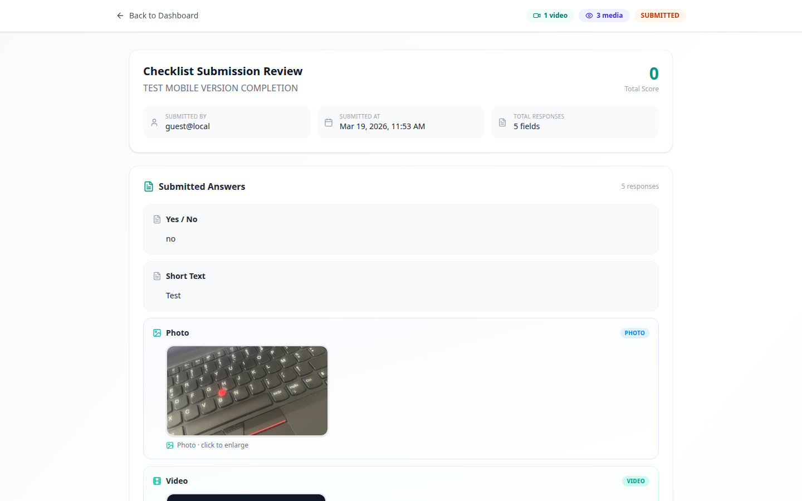
*Figure 18 – Validation screen: submission overview with metadata and operator answers*

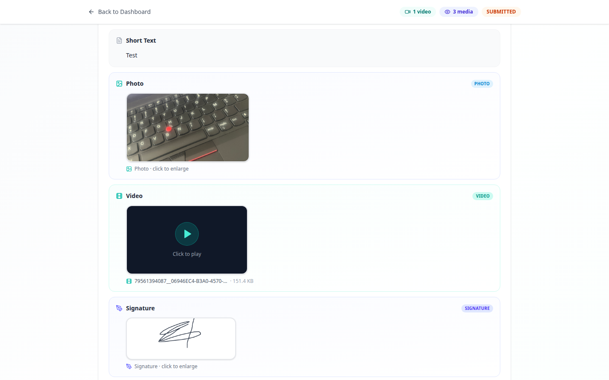
*Figure 19 – Validation screen: detailed field answers with scores and flag indicators*

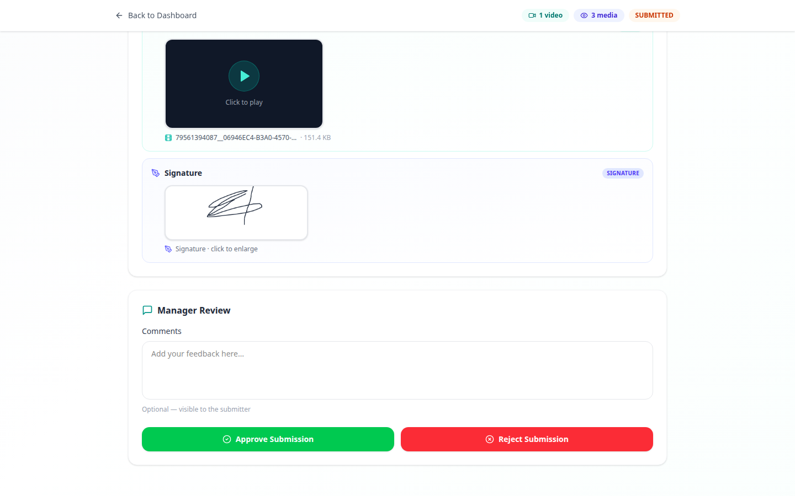
*Figure 20 – Validation screen: approve/reject buttons with mandatory comment field*

**Acceptance Criteria:**

- Accessible from the Dashboard "Pending Validations" tab or from a notification link.
- Displays all submitted answers with:
  - Field label.
  - Submitted value (formatted appropriately per field type).
  - Field score and flag status.
  - Any attached media (photo, video, file) with a lightbox viewer.
  - Any signature submitted.
- Displays submission metadata:
  - Submitted by (operator name).
  - Submission date and time.
  - Checklist title, category, location.
  - Total score.
- Displays all field declarations linked to this submission (tags, immediate actions, action items, risk assessments).
- A **Comments** text area is available for the manager to leave feedback.

---

#### E5.US2 – Approve Submission

As a manager, I want to approve a submission to mark it as validated and inform the operator.

**Acceptance Criteria:**

- An **Approve** (green) button is displayed at the bottom of the validation screen.
- On click:
  - A confirmation dialog is shown.
  - Upon confirmation, the submission status is updated to **Validated**.
  - The operator receives an in-app and/or email notification informing them that their submission has been approved.
  - The validation event is logged in the history of changes (who approved, when).

---

#### E5.US3 – Reject Submission

As a manager, I want to reject a submission and require the operator to review and resubmit.

**Acceptance Criteria:**

- A **Reject** (red) button is displayed at the bottom of the validation screen.
- Comments are **mandatory** before a rejection can be confirmed.
- On confirmation:
  - The submission status is updated to **Rejected / To Be Reviewed**.
  - The manager's comment is saved and displayed to the operator.
  - The operator receives an in-app and/or email notification with the rejection reason.
  - The rejection event is logged in the history of changes.
- The operator can re-open the submission, make corrections, and resubmit for validation.

---

## EPIC 6 – FIELD DECLARATIONS

Field declarations are operational events that can be declared by operators during or after checklist execution. They are linked to the submission for full traceability and can be triggered automatically by the trigger engine or declared manually.

### EPIC 6 LIST OF USER STORIES

| Epic ID | Requirement |
|---------|-------------|
| E6.US1 | Tag / Anomaly Declaration |
| E6.US2 | Immediate Action Declaration |
| E6.US3 | Closure Event Declaration |
| E6.US4 | Action Item Declaration |
| E6.US5 | Risk Assessment Declaration |

---

### USER STORIES DESCRIPTION

#### E6.US1 – Tag / Anomaly Declaration

As an operator, I want to declare an anomaly or tag during checklist execution so that it can be tracked and resolved by the appropriate team.

**Trigger:** Available via the floating action bar during execution, or opened automatically by a trigger impact `open_tag`.

**Acceptance Criteria – Tag Declaration Form:**

1. **Tag Type**: Dropdown with options: Maintenance / Operator / Safety. Mandatory.
2. **Anomaly Category**: Dropdown list of anomaly categories. Mandatory.
3. **Criticality**: Dropdown with options: Critical, High, Medium, Low, Very Low. Mandatory.
4. **Description**: Free-text field describing the anomaly. Mandatory.
5. **Resolution Responsibility**: Dropdown to assign the responsible team or person. Mandatory.
6. **Attachments**: Option to attach photos, audio recordings, or video evidence. Optional.
7. **Location**: Pre-filled from the checklist location; editable. Optional.

On submission, the tag is saved to the backend and linked to the current submission.

---

#### E6.US2 – Immediate Action Declaration

As an operator, I want to declare an immediate corrective action that must be taken right away in response to a finding during checklist execution.

**Trigger:** Available via the floating action bar (flash icon), or opened automatically by a trigger impact `open_action`.

**Acceptance Criteria – Immediate Action Form:**

1. **Action Description**: Free-text field. Mandatory.
2. **Action Owner**: Dropdown to assign the responsible person. Mandatory.
3. **Category**: Dropdown with action categories. Mandatory.
4. **Sub-category**: Conditional dropdown dependent on category selection. Optional.
5. **Attachments**: Upload photo, audio, or video evidence. Optional.

On submission, the immediate action is saved to the backend and linked to the current submission.

---

#### E6.US3 – Closure Event Declaration

As an operator, I want to declare a formal closure event at the end of a checklist execution to document the resolution of an identified issue.

**Trigger:** Available in the Completion Actions Modal (E4.US6) before final submission.

**Acceptance Criteria:**

- Fields include: Event type, Description, Date of closure, Responsible person.
- The closure event is linked to the submission.

---

#### E6.US4 – Action Item Declaration

As an operator, I want to create a follow-up action item for issues that cannot be resolved immediately during checklist execution.

**Trigger:** Available in the Completion Actions Modal (E4.US6), or triggered automatically by the trigger engine.

**Acceptance Criteria:**

1. **Description**: Free-text field. Mandatory.
2. **Action Owner**: Dropdown to assign to a user. Mandatory.
3. **Due Date**: Calendar date picker. Mandatory.
4. **Priority**: Dropdown (Low, Medium, High). Optional.
5. **Category / Sub-category**: Dropdown selectors. Optional.
6. **Comment**: Additional notes. Optional.
7. **Attachments**: Upload supporting documents. Optional.
8. **Status**: Set to "Open" by default. Updated over time to Completed or Cancelled.

---

#### E6.US5 – Risk Assessment Declaration

As an operator, I want to log a risk identified during checklist execution using a structured risk matrix.

**Trigger:** Available in the Completion Actions Modal (E4.US6), or triggered automatically by the trigger engine (`open_risk`).

**Acceptance Criteria:**

- The operator selects a **Likelihood** level and an **Impact** level from predefined scales.
- The system automatically calculates and displays the **Risk Level** (Low / Medium / High / Critical) based on the likelihood × impact matrix.
- Fields include: Risk description, Likelihood, Impact, Risk level (auto-calculated), Responsible owner, Due date for mitigation.
- The risk assessment is saved to the backend and linked to the submission.

---

## EPIC 7 – NOTIFICATIONS

### EPIC 7 LIST OF USER STORIES

| Epic ID | Requirement |
|---------|-------------|
| E7.US1 | Notification Settings Page |
| E7.US2 | New Assignment Notification |
| E7.US3 | Submission Pending Validation |
| E7.US4 | Submission Validated |
| E7.US5 | Submission Rejected |
| E7.US6 | Action Item Status Change |
| E7.US7 | Overdue / Reevaluation Reminder |
| E7.US8 | Trigger-Based Notifications |

---

### USER STORIES DESCRIPTION

#### E7.US1 – Notification Settings Page

As a user, I want to manage my notification preferences so that I only receive the notifications that are relevant to my role.

**Acceptance Criteria:**

- Accessible from the user menu or settings.
- Each notification type is listed with:
  - A description of when it is triggered.
  - A toggle to enable/disable **Email** notifications for that type.
  - A toggle to enable/disable **In-App** notifications for that type.
- Notification types available per role:

| Notification Type | Operator | Manager |
|---|---|---|
| New assignment | Yes | No |
| Submission validated | Yes | No |
| Submission rejected | Yes | No |
| Submission pending validation (from operator) | No | Yes |
| Action item status change | Yes | Yes |
| Overdue / reevaluation reminder | Yes | Yes |
| Trigger-based notification | Yes | Yes |

---

#### E7.US2 – New Assignment Notification

As an operator, I need to receive a notification when a new checklist is assigned to me.

**Acceptance Criteria:**
- Notification is triggered immediately upon assignment creation.
- Notification includes: checklist title, due date, assigned by (manager name).
- Sent via in-app notification and/or email based on user preferences.

---

#### E7.US3 – Submission Pending Validation

As a manager, I need to receive a notification when an operator submits a checklist that requires my validation.

**Acceptance Criteria:**
- Notification is triggered immediately on submission.
- Notification includes: checklist title, operator name, submission date, link to validation screen.
- Sent via in-app notification and/or email.

---

#### E7.US4 – Submission Validated

As an operator, I need to receive a notification when my submission is validated by the manager.

**Acceptance Criteria:**
- Notification includes: checklist title, validated by (manager name), validation date.
- Sent via in-app notification and/or email.

---

#### E7.US5 – Submission Rejected

As an operator, I need to receive a notification when my submission is rejected, along with the rejection reason.

**Acceptance Criteria:**
- Notification includes: checklist title, rejection reason (manager comment), rejected by (manager name).
- Sent via in-app notification and/or email.

---

#### E7.US6 – Action Item Status Change

As a user, I need to receive a notification when the status of an action item linked to one of my submissions changes.

**Acceptance Criteria:**
- Triggered when an action item status changes (Open → Completed or Cancelled).
- Notification includes: action item description, new status, associated checklist title.
- Sent via in-app notification and/or email.

---

#### E7.US7 – Overdue / Reevaluation Reminder

As a user, I need to receive a reminder notification when a checklist assignment is overdue or approaching its due date.

**Acceptance Criteria:**
- Triggered automatically based on the assignment due date.
- Reminders are sent according to the Priority level of the checklist:
  - **Urgent**: High frequency of reminders.
  - **High**: Moderate frequency.
  - **Normal**: Standard reminder.
  - **Low**: Single reminder at due date.
- Notification includes: checklist title, original due date, time overdue.
- Sent via in-app notification and/or email.

---

#### E7.US8 – Trigger-Based Notifications

As a manager, I want to configure checklist triggers that send notifications to specific users or roles when a field condition is met during execution.

**Acceptance Criteria:**
- Available as impact types `notify_inapp` and `notify_email` in the Trigger Builder (E3.US5).
- Configuration includes: target user (specific user or role), notification message (free-text or auto-generated), channel (in-app / email).
- The notification is sent in real time when the trigger condition fires during execution.

---

## EPIC 8 – HISTORY OF CHANGES

### EPIC 8 LIST OF USER STORIES

| Epic ID | Requirement |
|---------|-------------|
| E8.US1 | Activity Log |
| E8.US2 | Document Version History |

---

### USER STORIES DESCRIPTION

#### E8.US1 – Activity Log

As a user, I want to view a chronological log of all actions performed on a checklist or submission so that I can see what happened, when, and by whom.

**Acceptance Criteria:**

- An activity log panel is accessible from the detail view of any checklist or submission.
- The log displays entries in reverse chronological order (most recent first).
- Each log entry includes:
  - **Action type**: e.g., Created, Updated (with changed field names), Published, Submitted, Validated, Rejected, Status changed.
  - **Timestamp**: Date and time of the action.
  - **Actor**: Name and role of the user who performed the action.
- The log is **read-only** and cannot be modified.
- Filtering options:
  - By date range.
  - By action type.
  - By user.
- Export functionality: The log can be exported in **CSV** or **PDF** format for audit purposes.

---

#### E8.US2 – Document Version History

As a manager, I want to track the version history of a checklist so that I can understand how it evolved over time and retrieve any previous version.

**Acceptance Criteria:**

- Each time a checklist is saved (autosave or manual save), a new version is recorded with an incremented version number.
- A version history panel displays all recorded versions with:
  - Version number.
  - Save date and time.
  - User who saved the version.
  - Optional description of changes.
- Managers can view any previous version in read-only mode.
- Managers can restore a previous version (creates a new version rather than overwriting history).
- The system prevents deletion of historical versions to maintain full traceability.
- The latest version is clearly marked as "Current."
- Version history is exportable for compliance purposes.

---

## EPIC 9 – REPORTS & ANALYTICS

### EPIC 9 LIST OF USER STORIES

| Epic ID | Requirement |
|---------|-------------|
| E9.US1 | Reports Overview |
| E9.US2 | Completion Rate by Checklist |
| E9.US3 | Non-Conformities & Flagged Fields |
| E9.US4 | Action Items Overview |
| E9.US5 | Tag & Anomaly Report |
| E9.US6 | Filters |
| E9.US7 | Export |

---

### USER STORIES DESCRIPTION

#### E9.US1 – Reports Overview

As a manager, I want a dedicated reports section that provides visual and tabular insights into the performance and compliance of checklist operations across my plant.

**Acceptance Criteria:**

- Accessible from the navigation menu (Manager role only).
- The reports page contains multiple tabs or sections, one per report type.
- All reports update dynamically based on the selected filters (see E9.US6).
- Charts use consistent color coding aligned with the application design system:
  - Green: Completed / OK.
  - Yellow: In Progress / Pending.
  - Red: Overdue / Not OK / Critical.
  - Gray: Cancelled.

---

#### E9.US2 – Completion Rate by Checklist

As a manager, I want to see the completion rate for each checklist so that I can identify which checklists have low compliance.

**Visualization:**
- Bar chart with one bar per checklist.
- Bar height represents the completion rate (%).
- Color-coded: Green (≥ 80%), Yellow (50–79%), Red (< 50%).

**Acceptance Criteria:**
- Chart displays completion rates for all checklists within the selected filters.
- Clicking a bar drills down to the list of submissions for that checklist.
- Filters available: Date range, Location, Team, Category, Frequency.

---

#### E9.US3 – Non-Conformities & Flagged Fields

As a manager, I want to analyze which fields are most frequently flagged as non-conformant so that I can identify recurring operational issues.

**Visualization:**
- Bar chart: X-axis = field label, Y-axis = count of non-conformant submissions.
- Line chart overlay: Count of total submissions per field.

**Acceptance Criteria:**
- Chart displays the top flagged fields across all checklists (or within selected filters).
- Filters available: Date range, Location, Team, Checklist, Category.

---

#### E9.US4 – Action Items Overview

As a manager, I want a table showing all action items created from checklist executions along with their current status.

**Visualization:**
- Table with columns: Action ID, Description, Linked Checklist, Owner, Due Date, Status.
- Status is color-coded (Open = Blue, Completed = Green, Cancelled = Gray, Overdue = Red).

**Acceptance Criteria:**
- Table updates dynamically based on selected filters.
- Filters available: Date range, Location, Owner, Status.
- Clicking a row opens the action item detail view.

---

#### E9.US5 – Tag & Anomaly Report

As a manager, I want to view and analyze all tags and anomalies declared across checklist executions.

**Visualization:**
- Bar chart grouped by Tag Type (Maintenance / Operator / Safety) and Criticality.
- Table below the chart listing individual tags.

**Acceptance Criteria:**
- Filters available: Date range, Location, Team, Criticality, Tag Type, Status.
- Table columns: Tag ID, Anomaly Category, Criticality, Declared By, Declaration Date, Status.
- Clicking a row opens the tag detail view.

---

#### E9.US6 – Filters

As a manager, I want to filter all reports based on various criteria so that I can focus on specific data relevant to my operational scope.

**Acceptance Criteria:**

- Filters available across all report pages:
  - **Date Range**: Start and end date for the reporting period.
  - **Location**: Site, Zone, Line (hierarchical selector).
  - **Team**: Filter by assigned team.
  - **Category**: Filter by checklist category.
  - **Frequency**: Permanent, One-off, Recurring.
  - **Status**: Completed, In Progress, Overdue, Cancelled.
  - **My Data**: Toggle to show only data relevant to the logged-in manager.
- A **Reset** button clears all active filters.
- Active filters are displayed as removable chips below the filter bar.
- All visualizations and tables update instantly upon filter change.

---

#### E9.US7 – Export

As a manager, I want to export any report so that I can use the data outside the application for audits, presentations, or further analysis.

**Acceptance Criteria:**

- An **Export** button is available on every report page.
- Supported export formats:
  - **XLSX / CSV**: Tabular data export with all visible columns, respecting active filters.
  - **PDF**: Formatted report with charts (as images), tables, active filter context, and report generation timestamp.
- The export reflects the currently active filters — only the data visible in the report is included.
- The exported file is named using the format: `eCheck_Report_[ReportType]_[YYYYMMDD].xlsx`.

---

## APPENDIX A – MOBILE INTERFACE

eCheck is designed to be fully responsive and usable on mobile devices (smartphones and tablets). Operators on the factory floor primarily use the application on handheld devices to fill out checklists, declare tags, and submit evidence directly from the work area.

### Mobile – Operator View

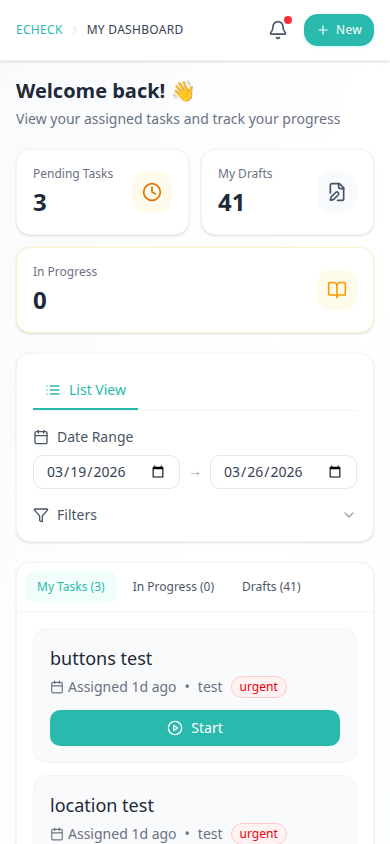
*Figure 21 – Mobile operator dashboard: task list optimized for touch interaction on a 390px screen*

### Mobile – Manager View

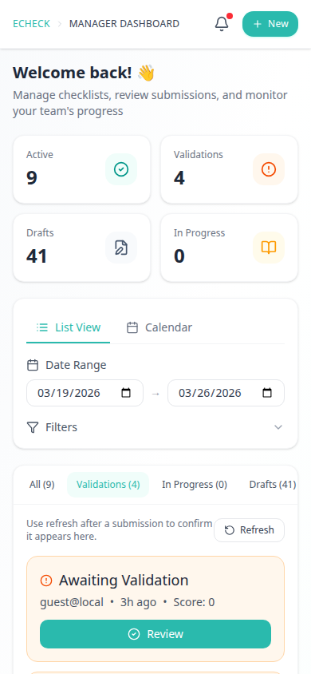
*Figure 22 – Mobile manager dashboard: checklist management and validation access from a mobile device*

**Mobile Design Principles:**
- All interactive elements (buttons, inputs, dropdowns) are sized for touch (minimum 44×44px tap targets).
- Section navigation in the execution screen uses full-width buttons for easy tapping.
- Media capture (photo, video) uses the native device camera.
- The signature field uses finger-draw on a full-width canvas.
- The filter bar collapses into a drawer on small screens.

---

*End of Document*

---

**Document Reference**: eCheck BRD V1.0.0
**Date**: 19/03/2026
**Status**: Draft – Pending Review
